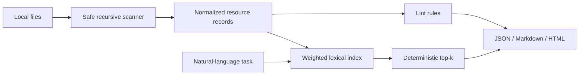

# Task2Tool

[](https://github.com/mockingbird777/task2tool/actions/workflows/ci.yml)
[](https://mockingbird777.github.io/task2tool/)
[](LICENSE)
[](package.json)

**Turn a natural-language task into the shortest useful list of local AI-agent capabilities.**

Task2Tool recursively discovers `SKILL.md`, `*.agent.md`, `*.prompt.md`, MCP server configurations, and portable catalog JSON. Its deterministic BM25-inspired ranker helps an agent select a few relevant resources instead of placing an entire tool registry in the context window.

[Try the interactive demo](https://mockingbird777.github.io/task2tool/) · [Read the roadmap](ROADMAP.md) · [Report a problem](https://github.com/mockingbird777/task2tool/issues/new/choose)

> Local-first means local: no account, hosted index, API key, telemetry, or runtime dependency.

## Why this exists

Agent ecosystems are getting composable—and crowded. MCP servers, reusable skills, subagents, and prompt libraries are useful, but advertising every capability on every turn consumes context and makes tool choice noisy. Task2Tool adds a tiny retrieval layer:

```text
natural-language task → local scan → weighted lexical index → top-k capabilities
```

It is intentionally not an agent framework. It finds candidates; your runtime decides what to load or invoke.

## Quick start

Run directly from GitHub with Node.js 20 or newer:

```bash
npx --yes github:mockingbird777/task2tool --help
```

Find resources for a task:

```bash
npx --yes github:mockingbird777/task2tool find \
  "review a pull request for security and reliability bugs" \
  --root ./my-agent-library
```

Create a machine-readable inventory:

```bash
npx --yes github:mockingbird777/task2tool index ./my-agent-library \
  --format json --output task2tool-index.json
```

Check catalog health:

```bash
npx --yes github:mockingbird777/task2tool lint ./my-agent-library
```

For frequent use:

```bash
npm install --global github:mockingbird777/task2tool
task2tool find "summarize an incident timeline" --root ~/agents
```

## Commands

### `task2tool index [directory]`

Scans a directory recursively and emits a stable, sorted resource inventory.

```bash
task2tool index .
task2tool index . --format html --output task2tool-report.html
```

### `task2tool find <task>`

Ranks indexed resources against a natural-language task. Names, tags, descriptions, headings, and resource text receive different weights; results include scores and matched terms.

```bash
task2tool find "query postgres data and inspect schemas" --root . --limit 5
task2tool find "調查安全漏洞" --root . --format json
```

The query may be unquoted, but quoting it avoids shell interpretation. `--limit` accepts 1–100.

### `task2tool lint [directory]`

Reports invalid catalog JSON, malformed MCP entries, duplicate IDs, weak metadata, oversized input, and likely inline secrets in MCP environment fields. Errors return exit code `1`; invocation failures return `2`.

```bash
task2tool lint . --format markdown
```

All commands support `json`, `markdown` (or `md`), and self-contained `html`. A file extension passed to `--output` selects the format when `--format` is omitted. Writes are atomic and newly created reports use owner-only permissions.

## What gets discovered

| Source | Pattern | Resource kind |
| --- | --- | --- |
| Skills | `SKILL.md`, `*.skill.md` | `skill` |
| Agent definitions | `*.agent.md` | `agent` |
| Prompt libraries | `*.prompt.md` | `prompt` |
| MCP configuration | JSON with `mcpServers` | one `mcp-server` per entry |
| Catalogs | `catalog.json`, `*.catalog.json`, or schema-shaped JSON | declared kind |

Markdown may include lightweight frontmatter:

```markdown
---
name: Pull Request Risk Reviewer
description: Review changes for correctness, security, and regression risks.
tags: [code-review, security, testing]
---
```

Task2Tool extracts a fallback name and description from headings and prose when frontmatter is absent.

Directories commonly containing generated or private implementation state are skipped: `.git`, `node_modules`, `dist`, `coverage`, and `.task2tool`. Symbolic links are not followed. Files larger than 1 MiB are skipped and linted when they look like a supported resource.

## Portable catalog format

The ARD-inspired catalog is deliberately small. It describes capabilities without prescribing how an agent runtime installs or invokes them:

```json
{
  "$schema": "https://raw.githubusercontent.com/mockingbird777/task2tool/main/schema/catalog-v1.schema.json",
  "catalogVersion": 1,
  "name": "Platform team capabilities",
  "resources": [
    {
      "id": "incident-brief",
      "name": "Incident Brief Writer",
      "kind": "prompt",
      "description": "Turn an operational timeline into a blameless incident brief.",
      "tags": ["sre", "writing"],
      "capabilities": ["summarize timelines", "extract follow-ups"],
      "path": "./incident-brief.prompt.md"
    }
  ]
}
```

See the working [`examples`](examples) and the versioned [JSON Schema](schema/catalog-v1.schema.json).

## Retrieval model

Task2Tool uses deterministic lexical retrieval rather than embeddings or a remote model:

1. Normalize Unicode with NFKC, lowercase text, remove a small stop-word set, and add bigrams for CJK tokens.
2. Weight names ×4, tags ×3, descriptions ×2, and content ×1.
3. Score query terms with BM25-style term-frequency saturation and document-length normalization.
4. Add small exact-phrase and all-terms bonuses.
5. Break ties by resource name, then stable resource ID.

This makes results fast, offline, explainable, and reproducible. It will not understand semantic synonyms that share no words; semantic reranking is intentionally left as an optional future layer.

## Privacy and security

- Reports never include MCP argument arrays or environment values. Only safe discovery metadata such as name, description, command, and transport is exported.
- `lint` warns when secret-like MCP environment keys contain inline values instead of `${ENVIRONMENT_VARIABLE}` references.
- HTML and Markdown output escape untrusted catalog fields. JSON output neutralizes HTML-significant characters.
- HTML reports include a restrictive content-security policy and require no network access.
- The scanner does not follow symbolic links and caps both file count and input size.

Task2Tool reads the directory you explicitly provide. Markdown text is used in memory for ranking, but only resource summaries are emitted. Review generated artifacts before sharing when filenames or descriptions themselves are sensitive.

For vulnerability reports, follow [SECURITY.md](SECURITY.md).

## Architecture



The implementation stays split by responsibility: `scanner.ts` owns bounded discovery and parsing, `search.ts` owns ranking, `lint.ts` owns catalog-quality rules, `format.ts` owns safe rendering, and `cli.ts` owns validation and atomic output.

## Development

```bash
git clone https://github.com/mockingbird777/task2tool.git
cd task2tool
npm install
npm test
npm run build
npm audit
```

The project targets strict TypeScript and Node.js 20+, has zero runtime dependencies, and tests scanning boundaries, deterministic ranking, multilingual tokenization, output escaping, lint behavior, and real CLI flows.

Contributions are welcome. Start with [CONTRIBUTING.md](CONTRIBUTING.md), use the issue templates for scoped proposals, and keep new integrations local-first.

## License

[MIT](LICENSE) © 2026 mockingbird777
